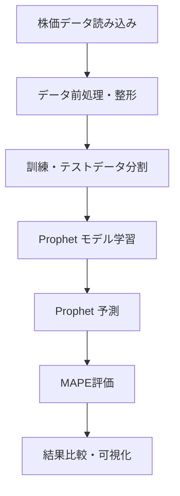

# 📈 Time Series Stock Price Prediction

> 大手通信関連企業の株価データを用いた時系列予測システム


## 🎯 プロジェクト概要

このプロジェクトは、某大手通信関連企業の株価データ（`stock_price.csv`）を使用して、機械学習による時系列予測を行うシステムです。複数の最新アルゴリズムを比較検証し、最適な予測モデルを提供します。

### ✨ 主な特徴

- **🤖 モデル**: Prophetを使用
- **📊 評価指標**: MAPE（Mean Absolute Percentage Error）による厳密な精度評価
- **🐳 Docker完全対応**: 環境構築の煩わしさを排除
- **📓 Jupyter Notebook**: インタラクティブな分析・可視化環境

## 🛠️ 使用技術スタック

| カテゴリ | 技術 | 用途 |
|----------|------|------|
| **予測モデル** | Prophet | 時系列予測（Facebook製） |
| **環境構築** | Docker | コンテナ化・環境統一 |
| **開発環境** | Jupyter Lab | インタラクティブ分析 |
| **評価指標** | MAPE | 予測精度測定 |

## 🚀 クイックスタート

### 前提条件
- Docker Desktop がインストールされていること
- Git がインストールされていること

### 📥 1. リポジトリのクローン
```bash
git clone <リポジトリURL>
cd time-series-prediction
```

### 🏗️ 2. Dockerイメージのビルド
```bash
docker build -t stock-prediction .
```

### 🚀 3. コンテナの起動
```bash
docker run -p 8888:8888 -v $(pwd):/work stock-prediction
```

### 🌐 4. Jupyter Notebookへのアクセス
1. ターミナルに表示されたURL（`http://127.0.0.1:8888/?token=...`）をコピー
2. ブラウザでアクセス
3. `time-series-prediction.ipynb` ファイルを開く

## 📁 プロジェクト構成

```
time-series-prediction/
├── 📄 Dockerfile                    # Docker環境設定
├── 📊 stock_price.csv              # 株価データ
├── 📓 time-series-prediction.ipynb  # メインノートブック
├── 📝 README.md                    # このファイル
└── 📋 requirements.txt             # Python依存関係
```

## 🔍 データ処理フロー



## 📊 モデル比較

| モデル | 特徴 | 適用場面 |
|--------|------|----------|
| **Prophet** | ✅ 高速学習<br>✅ 季節性自動検出<br>✅ 解釈しやすい | 季節性やトレンドが強いデータ |

## 📈 評価指標

**MAPE (Mean Absolute Percentage Error)**
```
MAPE = (1/n) × Σ |((実際値 - 予測値) / 実際値)| × 100%
```

- 低いほど高精度
- パーセンテージで直感的理解
- モデル間比較が容易

## 注意事項
- 実行環境について: Docker環境がない場合は、.ipynb ファイルを直接ローカルのJupyter環境、またはGoogle Colaboratoryで実行してください。その際、ライブラリについてはrequirements.txtを参考にしてください。
